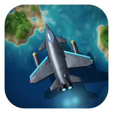
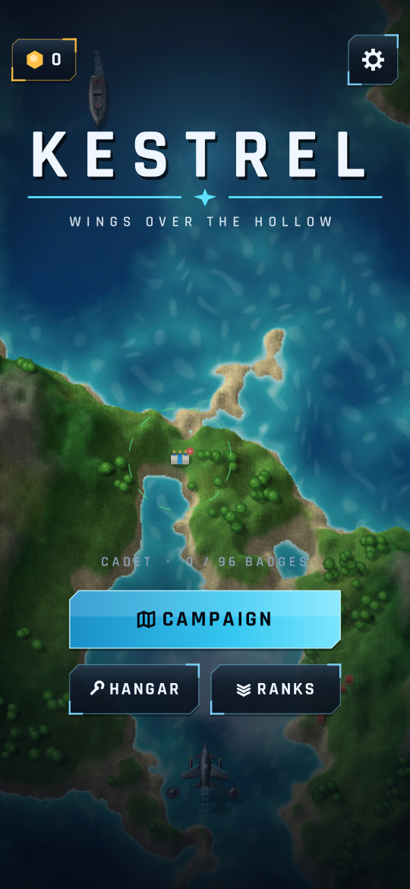
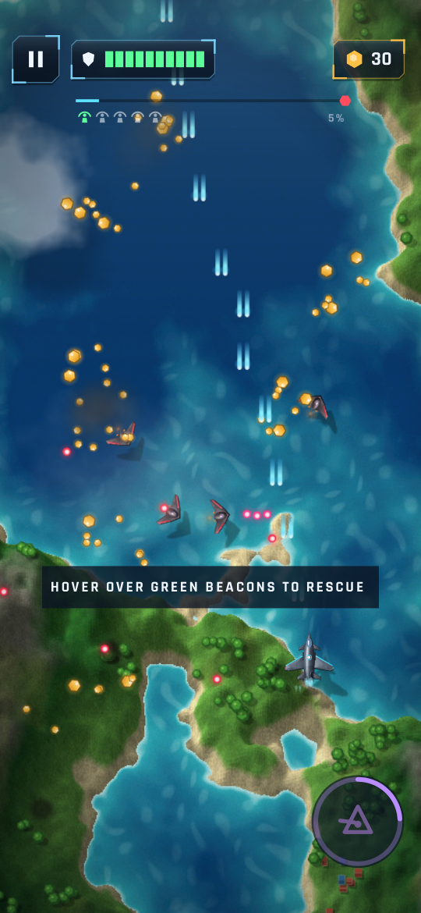
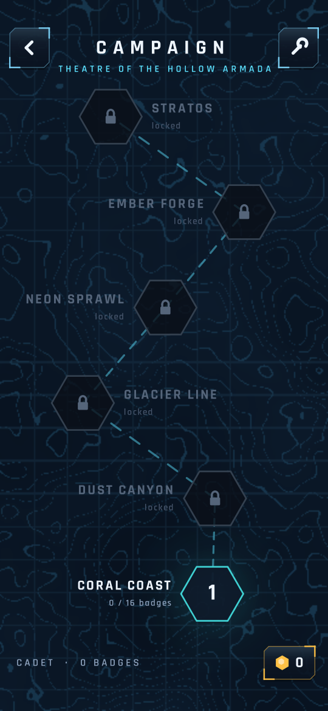
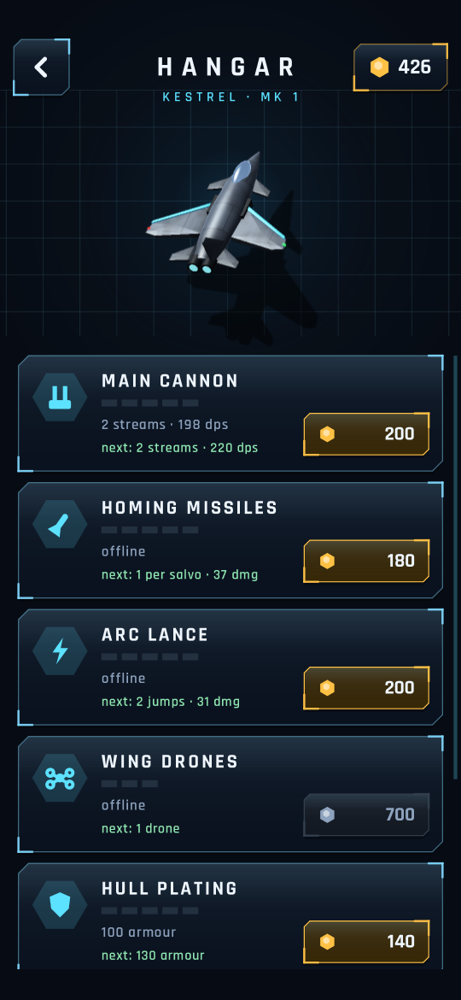

<p align="center">
  
</p>

<h1 align="center">Kestrel</h1>

<p align="center">
  <b>Wings over the Hollow: a vertical shooter for Android.</b><br>
  Six sectors, six bosses, four threat levels and 96 badges to earn.
</p>

<p align="center">
  <a href="https://github.com/pranvirsingh/Kestrel/releases/latest"></a>
  <a href="https://github.com/pranvirsingh/Kestrel/actions/workflows/ci.yml"></a>
  
  
  <a href="LICENSE"></a>
</p>

<p align="center">
  
  
  
  
</p>

## About

Kestrel is written in Kotlin with **no game engine and no third-party libraries**. All terrain, aircraft, effects, music and sound are generated in code. Every aircraft, tank, boat, turret and boss is a 3D model drawn by a small software renderer built into the game. The whole game is a ~900 KB APK, and the only permission it asks for is vibration.

## The campaign

There are 6 sectors, each with its own map, boss and challenge:

| Sector | Boss | Ace challenge |
|---|---|---|
| Coral Coast | Leviathan | Sink every gunboat |
| Dust Canyon | Sandcrawler | Destroy the armoured train |
| Glacier Line | Frostwall | Destroy the boss in 75 s |
| Neon Sprawl | Overseer | Destroy all 6 radar spires |
| Ember Forge | Crucible | Chain 35 kills |
| Stratos | Hollow King | Destroy all 3 carriers |

### Threat levels

Each sector has 4 threat levels: **I Recon, II Strike, III Siege and IV Nightmare**. Earn 3 badges at one threat level to unlock the next. Recon is gentle; Nightmare is brutal.

### Badges

Each sector has 4 badges per threat level, 96 in total:

- **Sweep:** destroy 80% of hostiles.
- **Lifeline:** rescue all 5 survivors.
- **Untouched:** take no damage.
- **Ace:** complete the sector's own challenge.

### Progression

- **Hangar:** spend the cores you collect on the main cannon, homing missiles, Arc Lance, wing drones, hull plating, core magnet and Prism Overdrive.
- **Pilot ranks:** your total badge count unlocks 10 permanent perks, from Salvager (4 badges) to Legend (all 96).

## Controls

- Drag anywhere to fly. The cannons fire on their own.
- Press the prism button or double-tap to trigger Overdrive. Time slows, a lance fires, and enemy rounds turn into cores.
- Hover over green beacons to rescue survivors.
- Settings: sound, music, vibration and control sensitivity. Progress is saved on the device.

## The look

- **3D models, drawn in software.** Models are built in `Models.kt` and rendered by `R3.kt` with specular highlights, rim light and grime. Turrets have 12 pre-rendered rotation frames.
- **Rendered once, then cached.** Unit sprites are rendered on first launch ("ASSEMBLING SQUADRON") and each boss on its first mission. Both are saved on the device, so later launches and missions skip the renderer.
- **Raised terrain.** Ground has real height (`Terrain.kt`): it is lit, casts soft shadows, and cliff faces are shaded as rock.

## Download

1. Open the [latest release](https://github.com/pranvirsingh/Kestrel/releases/latest) and download the `.apk`.
2. Open it on your phone. Android will ask you to allow installing apps from that source the first time.
3. Requires Android 7.0 (API 24) or newer.

## Build from source

`build.sh` produces `build/Kestrel.apk`. It needs:

- `aapt2`, `apksigner` and `d8.jar` (R8) from Android build-tools, plus `android.jar` for API 34
- the Kotlin compiler and standard library
- a JDK (for `java`, `jar` and `keytool`) and Python 3

The scripts expect the project at `/home/claude/kestrel` and the toolchain in `/home/claude/tc` under specific jar names. Those paths are hardcoded in `build.sh`, `kc.sh`, `t.sh` and in several tests (`BattleShots`, `UiShots`, `AudioTest`, `Monkey` and others). The easiest way to build is to recreate that layout, which is what [`.github/workflows/ci.yml`](.github/workflows/ci.yml) does on Ubuntu (build-tools 34, Kotlin 2.3.10, JDK 17) before running the scripts unchanged. On first run, `build.sh` creates a local signing key, so a locally built APK is for testing. It can't update an installed release build.

## Tests

The tests run on a plain JVM against a small Java2D shim of `android.graphics`:

```
mkdir -p shots      # the screenshot tests and AudioTest write their output here
./t.sh Monkey AudioTest Campaign UiShots BiomeShots Sheet3D SpriteSheet BattleShots CacheTest
```

- **Monkey:** 40,000 random input steps with process-death restores, checking for NaNs, leaks, overflowing hull and invalid upgrade levels.
- **AudioTest:** checks that every sound effect is audible and every music stem has the right loop length.
- **Campaign:** an autopilot plays the campaign from a fresh save through the real UI (map, briefing, mission, debrief, hangar shopping). Every mission must reach its debrief, and the test reports the sectors cleared and badges earned.
- **UiShots, BiomeShots, Sheet3D, SpriteSheet, BattleShots:** render every screen, every biome, the unit 3D models, the 2D sprites and sample battle moments to `shots/` (the screenshots above come from here). `Sheet3D` also renders the six bosses when given a second argument.
- **CacheTest:** builds the unit and boss sprites twice through the on-device cache, checks that the second set of units matches the first (sizes, and the player sprite pixel for pixel), and prints render vs cached times.
- **Balance** and **Pressure** print difficulty-tuning reports (clear times, damage taken, bullets on screen) and take several minutes. They aren't run in CI.

CI builds the APK and runs the tests above on every pull request.

## Project layout

| Path | What it is |
|---|---|
| `src/com/pranvir/kestrel/World.kt` | Mission simulation: player, enemies, bullets, pickups, scoring |
| `src/com/pranvir/kestrel/Game.kt` | Screens, menus, hangar, campaign progress and saves |
| `src/com/pranvir/kestrel/Defs.kt` | Upgrades, perks, threat levels, badges, sectors and enemy stats |
| `src/com/pranvir/kestrel/Level.kt`, `Boss.kt`, `BossArt.kt` | Mission scripting and the six bosses |
| `src/com/pranvir/kestrel/R3.kt`, `Models.kt`, `Units3D.kt`, `SprCache.kt` | Software 3D renderer, the models, pre-rendered unit frames and the on-device sprite cache |
| `src/com/pranvir/kestrel/Terrain.kt`, `Biomes.kt`, `Noise.kt` | Raised terrain and the six sector biomes |
| `src/com/pranvir/kestrel/Render.kt`, `Sprites.kt`, `Core.kt` | In-mission drawing, 2D sprites, colours, fonts and icons |
| `src/com/pranvir/kestrel/Synth.kt`, `Audio.kt` | Synthesised music stems, sound effects and the mixer |
| `src/com/pranvir/kestrel/MainActivity.kt` | Android entry point: view, input, haptics, storage |
| `jvmtest/` | JVM test harness and the `android.graphics` shim |
| `build.sh`, `kc.sh`, `zipalign.py`, `rules.pro` | Build: resources, Kotlin compile, R8, packaging, signing |

See [CHANGELOG.md](CHANGELOG.md) for release history.

## License

Code: [MIT](LICENSE) © 2026 Pranvir Singh.

Fonts: the bundled Rajdhani fonts (`assets/fonts/raj_semi.ttf`, `assets/fonts/raj_bold.ttf`) are © 2014 Indian Type Foundry, licensed under the [SIL Open Font License 1.1](docs/licenses/OFL-Rajdhani.txt).
